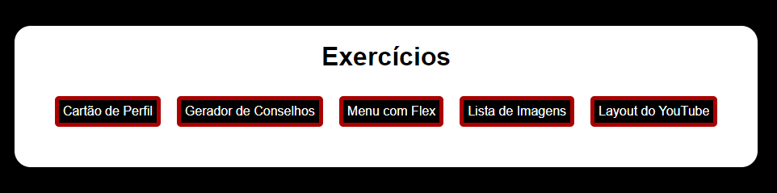
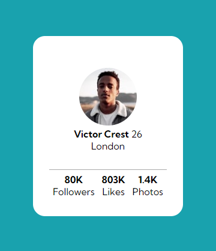
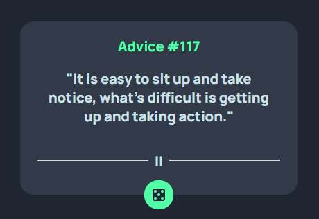
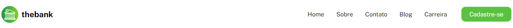
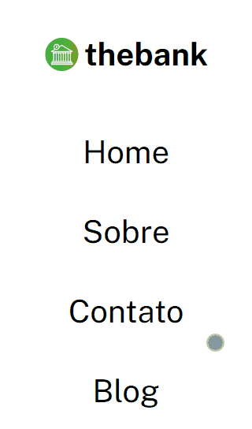
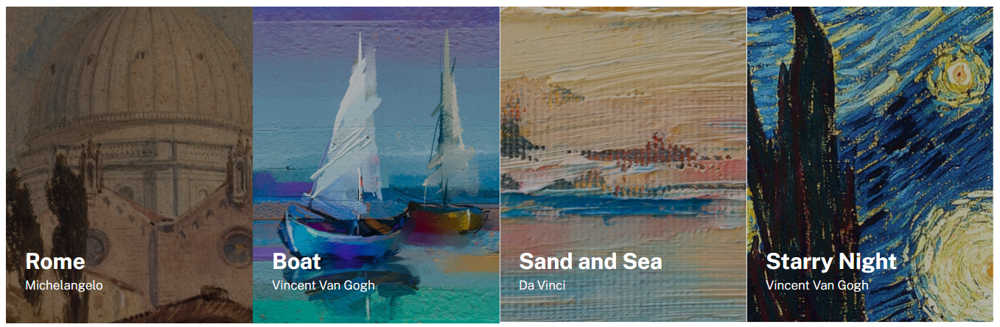
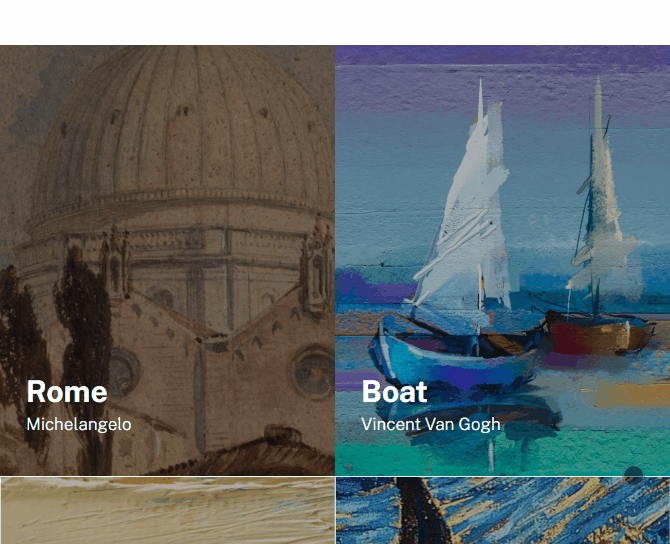
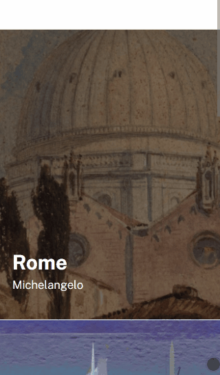
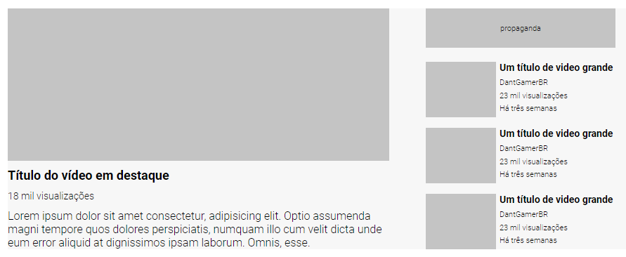

# Exercícios de HTML e CSS Avançado
Nesse repositório estão os exercícios de HTML e CSS avançado. A página inicial tem os botões com links que levam aos exercícios.

## Tecnologias utilizadas
- HTML;
- CSS.

## Exercício - Cartão de perfil
Nesse exercício foi criado um cartão de perfil, utilizando display flex para o posicionamento dos elementos na página. O exercício foi retirado do [Frontend Mentor](https://www.frontendmentor.io/challenges/profile-card-component-cfArpWshJ).

## Exercício - Gerador de conselhos
Nesse exercício foi criado uma página de estilo de um gerador de conselhos, utilizando display flex para estilização dos elementos. O exercício foi retirado do [Frontend Mentor](https://www.frontendmentor.io/challenges/advice-generator-app-QdUG-13db).

## Exercício - Menu com Flex
Nesse exercício foi desenvolvido o menu de uma página, usando o display flex para posicionar os elementos. O posicionamento dos elementos muda em dispositivos menores.

## Exercício - Lista de imagens
Nesse exercício foi uma criada lista de imagens usando display flex e position. A quantidade de imagens na linha muda conforme o tamanho do dispositivo.

## Exercício - Layout do YouTube
Nesse exercício foi criado um layout baseado no YouTube, foi utilizado para posicionamento o display grid. 

